## Term 1 Portfolio Project

# Julia Ohannessian - Portfolio

Welcome to my portfolio website. This is our Term 1 Assessment written in HTML and CSS for Coder Academy.

I really enjoyed creating my website from the ground up. I learnt a lot of cool tricks during this assignment and really pushed myself to try and do the things that challenged me. I hope that it reflects in my work and shows the skills I have gained along the way in HTML and CSS, but also provides a little glimpse into my personality. Although the website is not exactly what I had imagined it to be, I feel that I have achieved a great amount considering where I started from and the time restraints. Please find a link to my portfolio and github repo below:

My Portfolio URL: http://www.juliaoha.com/

My Github Repository: https://github.com/Juliaoha/portfolio

## Table of Contents

- [Purpose](#purpose)
- [Target Audience](#target-audience)
- [Design Process](#design-process)
  - [Structure & Sitemap](#structure-and-sitemap)
  - [Inspiration](#inspiration)
  - [Challenges](#challenges)
  - [Colour](#colour)
- [Functionality & Features](#functionality-and-features)
- [Tech Stack](#tech-stack)
- [Image References](#image-references)

## Purpose

As mentioned above this was a great opportunity for me to be able to show what I had learnt so far. Also, to target any future employers that might happen to visit my site ;) I have thoroughly enjoyed the process. Also, being able to put my skills to the test was fun and challenging all at the same time.

My purpose was to create a design philosophy that I would see through to the end. After seeing my classmates incredible work during the presentations I felt the urge to change my design multiple times. I wanted to be disciplined and stick to what I had already created. I felt like this would provide me with a better understanding on what I might need to improve on once I had completed the task.

## Target Audience

This was a big one for me, as I really love to include everyone. But I know that's not how it works in the real world. So narrowing it down to a group of people was something I had to really think about. I am definitely targeting future employers but it is also an opportunity to create an experience for my audience whilst sharing a little bit of my personality. I want to target a user that appreciates a story and a journey behind the work that is presented. Someone that sees the fun in the colour and class in the simplicity.

## Design Process

I love colour and I love being creative. I feel that naturally I am a very visual, imaginative driven person, maybe this stems from my background in Performing Arts. I like to know as much as I can before embarking on a journey and that's exactly what I did before beginning this process. I did lots of googling and youtubing before I started to see wher was the best place to start. I found this helped a lot when it came to planning my website. I was able to let my imagination flow freely whilst having a rough understanding of what my boundaries might be when it came to using HTML and CSS.

I am incredibly interesed in narrative and being able to tell a story which takes the user on a unique journey. Each section would tell a part of a story and then all the elements put together would form a whole collective narrative.

I wanted it to be minimal with a touch of colour. I wanted to create a look that conveyed simplicity but also wonder. I decided to use Figma for my design process as I had been told on numerous occasions that in the industry Figma and Adobe XD were the two most popular choices. I have used Adobe XD in the past and wanted to take this opportunity to try something new. Lucky for me the skills that I acquired while using Adobe XD transferred nicely over to Figma. Although they are not the same they have a lot of similarities. Here is a link to Figma:

Figma URL: https://www.figma.com/

I began the design process with colour. This is one of my favourite sites to use when it comes to selecting a colour palette:

My color URL: https://mycolor.space/

I always find that if I have an idea of colour, which of course can change throughout the process, it's a great springboard for me to bounce from. Originally I wanted to use black and white but then I found these two images below and it inspired me to go with a pastel palette.

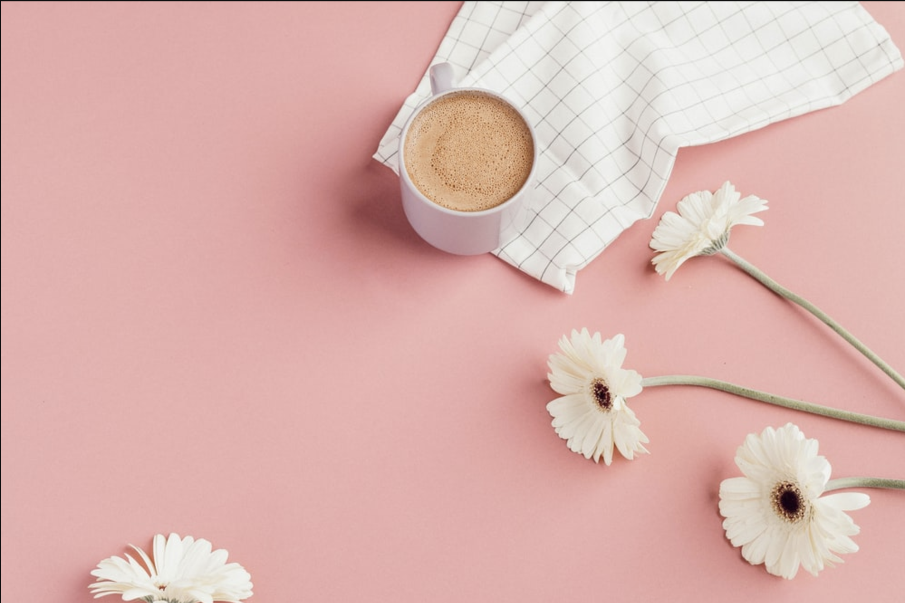

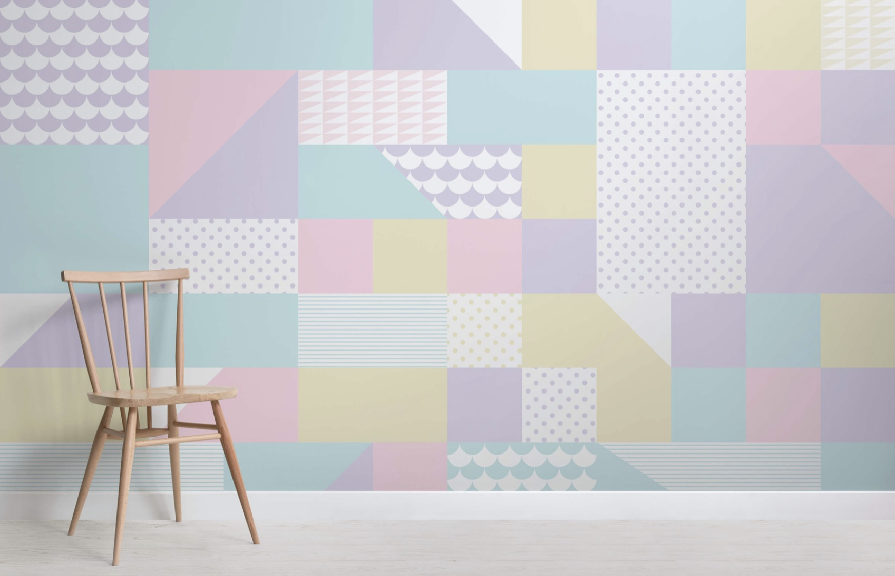

I stumbled across this image and decided to use it as my background. It was too busy and clashed with my orginal plan so I decided to use it as a splash of border colour.

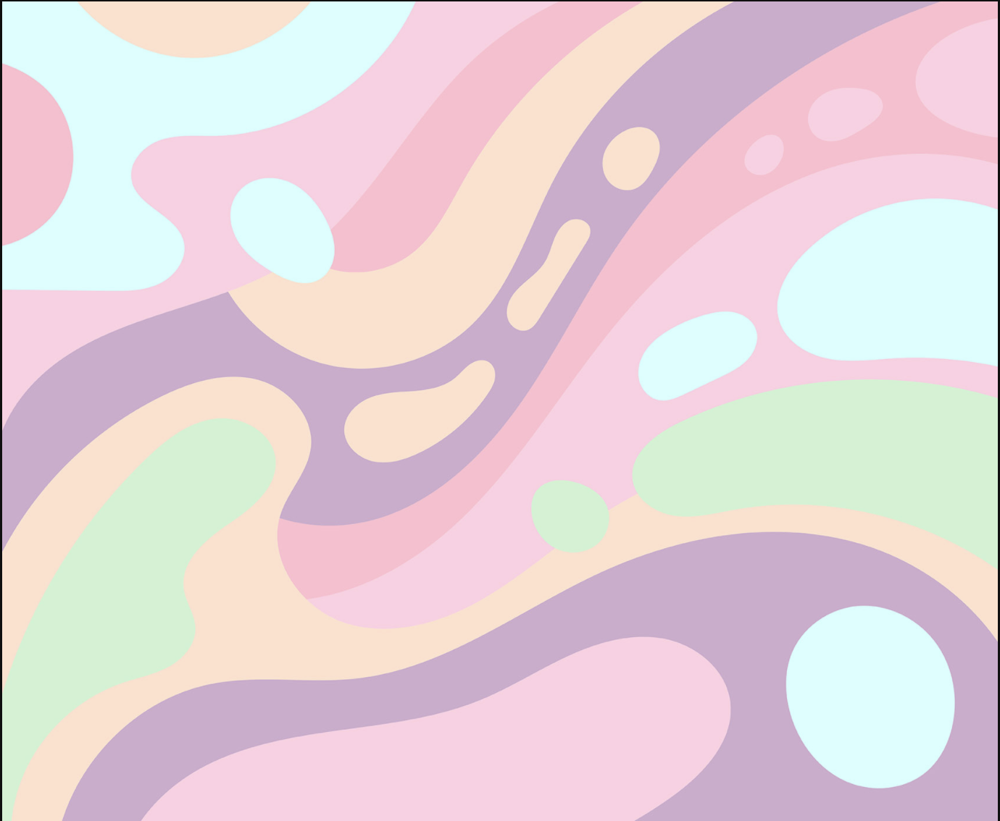

### Structure and Sitemap

I realised pretty quickly how important it was to plan when it comes to building a website. Without structure it's very easy to get lost in a land of endless ideas. A simple plan can soon become a crazy mess. It was much easier to create my website having a clear structure. I am glad I used Figma for planning and designing as I was able to chop and change until I created something that would transition smoothly to HTML and CSS.

I settled on this structure:

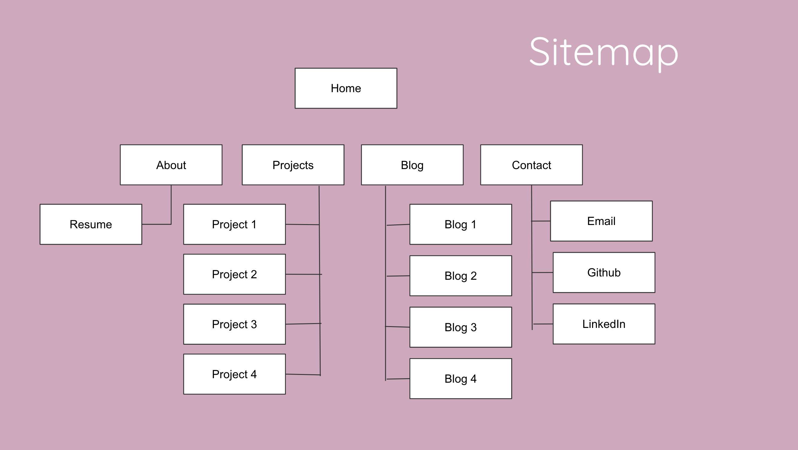

I really wanted to make my website simple by having multiple pages with hero text and a button instead of a one page scrolling website. I found this worked really well when it came to the mobile version but when I transitioned to desktop it was a little too sparse for my likings. Which is why I decided to add a tad bit more colour. This allowed me to keep the layout as stripped back as possible.

I wanted a short message to be the hero of the Home page. The social links to be in the top right-hand corner not as noticeable as the welcome message, but still present. And finally a button on every page to act as a through-line or a connection to the next window.

Given we had to consider multiple devices I decided to change the position of the Navbar to run down the left hand side of the page in desktop view. Whereas on all other devices it would be present at the top of the screen. please refer to images below:

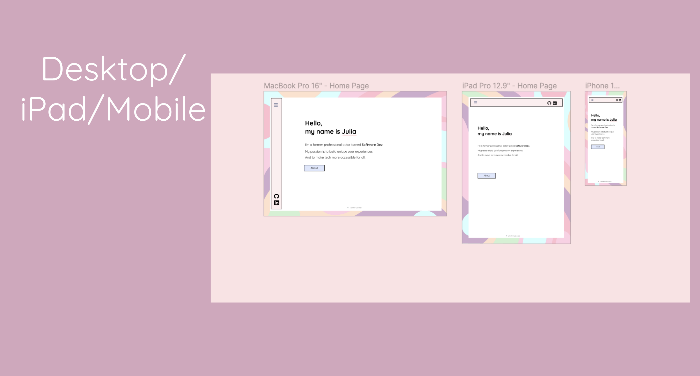

I was drawn more and more to a pastel colour palette. I felt that it was too plain when I used black and white, which was my original idea. These were the colours I decided to use:

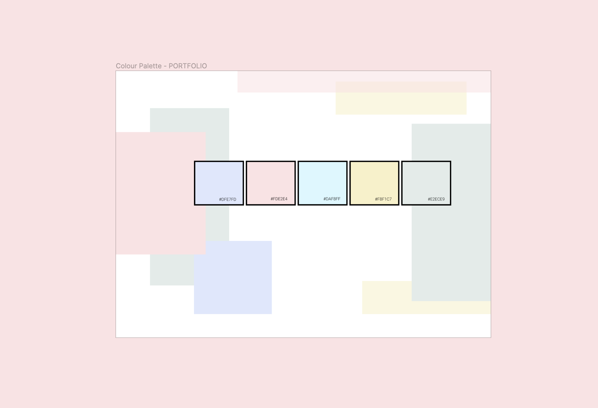

I wanted to play with where I wanted the focus to be on each page. I tried using images but found that they were a bit distracting and the images took away from the simplicity of my design. I also wanted each page to be part of that one story. It was a lot easier to achieve this without the use of images.

### Inspiration

My moodboard really helped me get into the right headspace. Once I had found the right images and colour I was able to spiral into a world of pastel bliss.

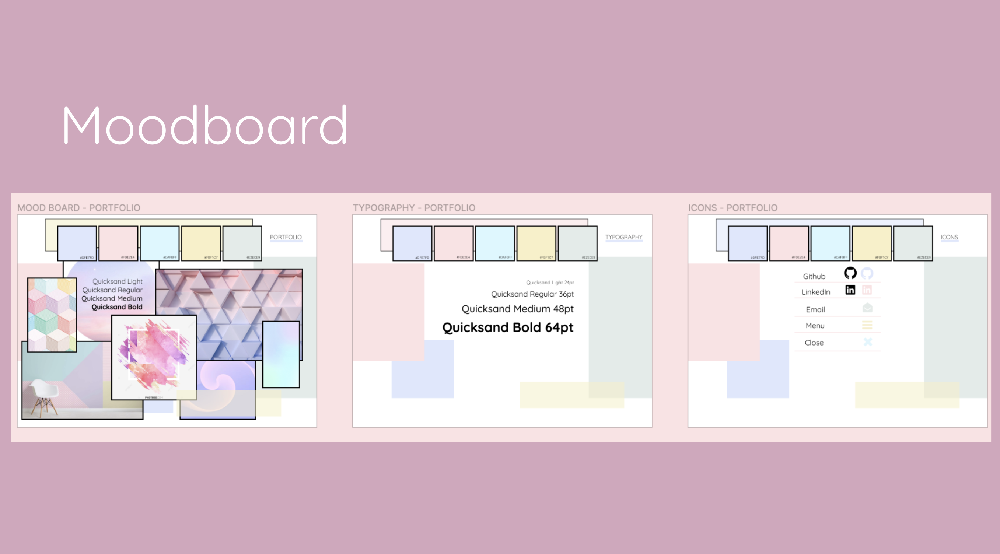

I sourced images for my moodboard that evoked a sense of space and calming fun. Many of the images and colours above relate to this idea of having fun. Below is an early sketch (wireframe) of my home page before I added colour:

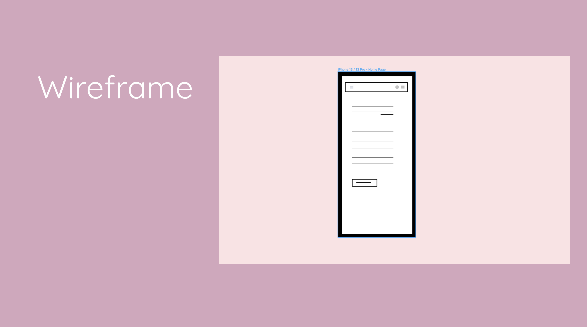

### Challenges

The biggest challenge I had was starting. I felt very overwhelmed at the beginning because I was trying to tackle everything all at once. I decided to use Trello and good old pen and paper to create a plan. Like I mentioned before it was very messy in my head which was why it was so hard to know where to start. But once I planned it out I knew where to start because I knew where I was going.

I found it challenging to know what code to use, as I found often there were a few options to choose from. I wanted to choose the one that was used most often in the industry.

Also, the positioning of the nav bar in desktop view was a bit of a challenge and unfortunately I didn't get to execute it at this stage but I plan to do it asap. In all other views the nav bar sits at the top of the page but in desktop view I wanted it to be positioned down the left hand side. I ran out of time to do this properly so I removed it for a later date.

### Colour

I started with black and white because I had seen a lot of websites that managed to captivate all the right things with just using these two colours. But then I kept looking at the pages and I just couldn't settle on that decision. When I was able to aritculate what my issue was with the original palette, it all became a lot clearer to me; I was missing colour.

As much as I was seeking elegance and class. I was also wanting the user to get the impression that I was fun.
I love having fun. And the black and white wasn't the best way to express that. So that's when I explored colour. Below are the colours I chose at the start and then where I went next before settling on the colours that I have now.

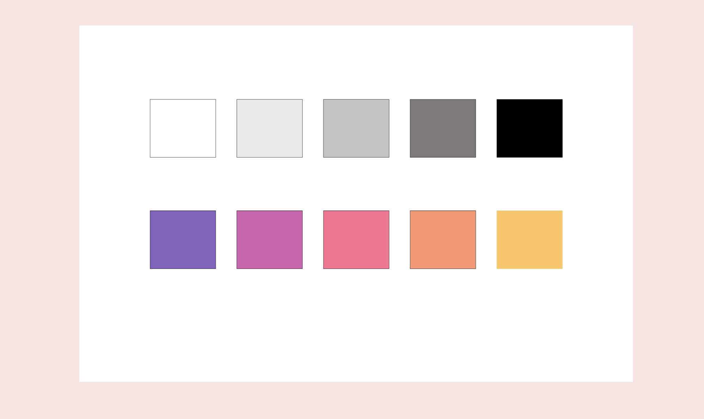

I loved that some of these choices were bold, but the pastel colours I settled on were very gentle. This is how I implemented them in my final design.

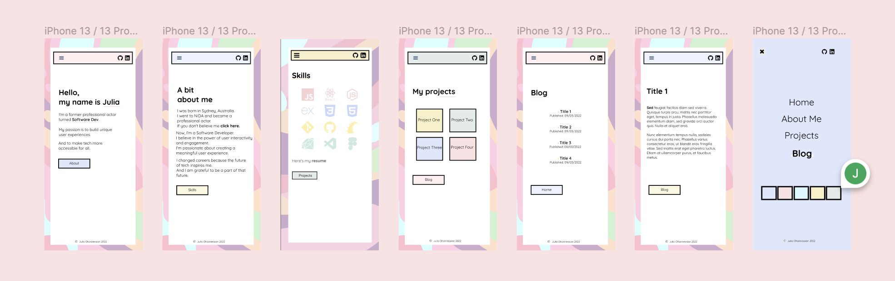

I'm glad I changed my mind in regards to colour. I find it captures my personality and it has a sense of fun.

## Functionality & Features

For my portfolio I have used HTML, CSS and the tiniest bit of JavaScript for the nav menu. I wanted to keep the theme consistant across all pages. I achieved this by repeating a group of four colours and a layout that was used across all pages. The features are purposefully very simple and straightforward. A nav bar, body, and a button.

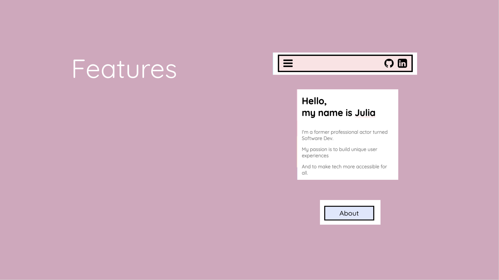

The main menu consists of the following:

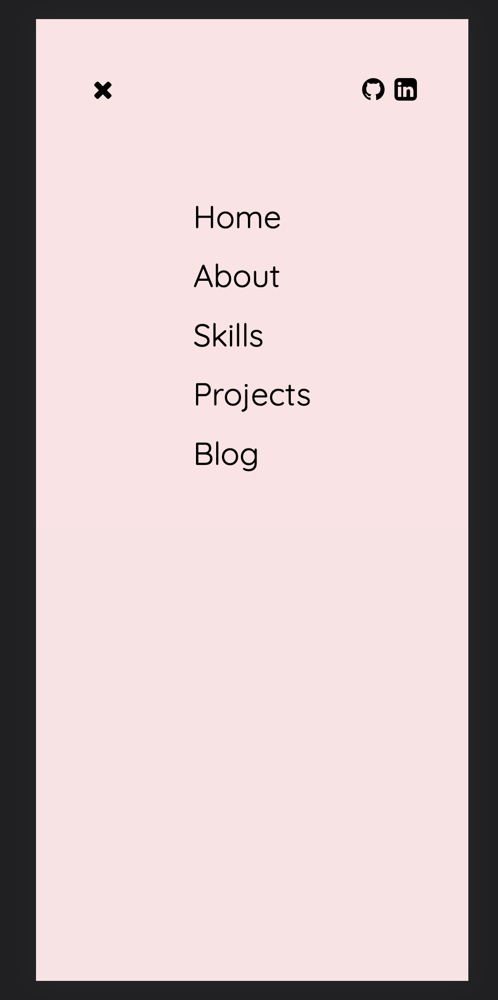

The was that every page would lead to the next through a simple click of a button but at any stage the user was able to exit any page through the main menu.

## Tech Stack

[HTML](https://html.spec.whatwg.org/) A standard markup language that I used to create my website.

[CSS](https://www.w3.org/TR/CSS/#css) A Cascading Style Sheet language which I used to style my website.

[JavaScript](https://www.javascript.com/) A programming language that I used to create my nav bar and menu.

[Visual Studio Code](https://code.visualstudio.com/) An IDE used to write and edit my code.

[Netlify](https://www.netlify.com) A generator which I used to host and deploy my portfolio.

[Liveserver](https://marketplace.visualstudio.com/items?itemName=ritwickdey.LiveServer) A Quick Development Live Server with live browser reload. Used this to view my website through VSC.

[Trello](https://trello.com/b/tflv8Iz7/portfolino-assignment) I used Trello to organise my assignment.

[Colorspace](https://mycolor.space/) A website that provides colour palettes and generates colour schemes.

[Font Awesome](https://fontawesome.com/icons) A website where I obtained my hamburger & close icons.

[Devicon](https://devicon.dev/) A bunch of icons representing programming languages. I pulled my skills icons from this site.

[Google Fonts](https://fonts.google.com/) A website full of fonts. I used Quicksand for my website.

[Figma](https://www.figma.com/) Is a vector graphics editor and prototyping tool. I used Figma to do create my website from scratch, do my wireframes and prototypes.

### Image references:

- Unsplash: https://unsplash.com/s/photos/pastel
- Murals Wallpaper: https://www.muralswallpaper.co.uk/app/uploads/Block-Pattern-Geometric-Pastel-Wallpaper-Mural-room.jpg
- Figma Images: Personal Source
- Vecteezy: https://www.vecteezy.com/free-vector/pastel-background
