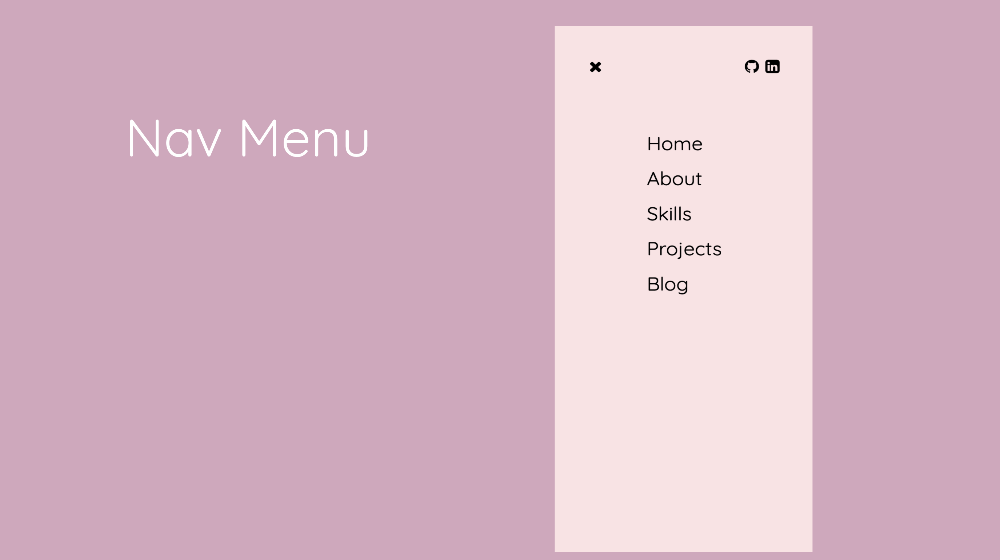

## Term 1 Portfolio Project

# Julia Ohannessian - Portfolio

Welcome to my portfolio website. This is our Term 1 Assessment written in HTML and CSS.

I really enjoyed creating my website from the ground up. I hope that it shows the skills I have gained in HTML and CSS, and also provides a little glimpse into my personality.

My Portfolio URL: https://elated-khorana-6658ee.netlify.app

My Github Repository: https://github.com/Juliaoha/portfolio

## Table of Contents

- [Motivation](#motivation)
- [Design Process](#design-process)
  - [Structure & Sitemap](#structure-and-sitemap)
  - [Inspiration](#inspiration)
  - [Colour](#colour)
- [Features](#features)
- [Project Management](#project-management)

## Motivation

This was a great opportunity for me to be able to show what I have learnt so far. Also, to target any future employers that might happen to visit my site. I have thoroughly enjoyed the process and being able to put my skills to the test was fun and challenging.

My motivation was to create a design philosophy that I would see through to the end. After seeing my classmates incredible work during the presentations I felt the urge to change my design multiple times. I wanted to be disciplined and stick to what I had already designed. I felt like this would provide me with a better understanding on what I might need to improve on once I had completed it.

Also, I wanted to challenge myself with trying things in HTML and CSS that I hadn't explored before whilst not making it too impossible for me to achieve at this early stage in the course.

## Target Audience

I am thinking about future employers but it is also an opportunity to create an experience for my audience whilst sharing a little bit of my personality. I want to target a user that appreciates

## Design Process

I love colour and I love being creative. I feel that naturally I am a very visual person, maybe this stems from my background in Performing Arts. I do like to know as much as I can before embarking on a journey and I found this helped a lot when it came to planning my website. I was able to let my imagination flow freely whilst having a rough understanding of what my boundaries might be when it came to using HTML and CSS.

I am incredibly interesed in narrative and being able to tell a story which takes the user on a unique journey. Each section would tell a part of a story and then all the elements put together would form a whole collective narrative.

I wanted it to be minimal with a touch of colour. I wanted to create a look that conveyed simplicity but also wonder.

### Structure and Sitemap

I realised pretty quickly how important it was to plan when it comes to building a website. Without structure it's very easy to get lost. A simple idea can soon become a crazy mess. It was much easier to create my website having a clear structure. I am glad I used Figma for planning and designing as I was able to chop and change until I created something that would transition smoothly to HTML and CSS.

I settled on this structure:

I wanted to make my website simple but having multiple pages I found the simplicity became an issue. It was a little too sparse. Which is why I decided to add a tad bit more colour. This allowed me to keep the layout as stripped back as possible.

### Inspiration

I sourced images for my moodboard that evoked a sense of space and calming fun. Many of the images and colours above relate to this idea of having fun but gently. Below is an early sketch of my home page before I added colour:

I wanted a short message to be the hero of the Home page. I wanted the nav bar links to be in the top right-hand corner not as noticeable as the welcome message, but still present. I also wanted a button to be present on every page to act as a through-line.

Given we had to consider both mobile and desktop I decided to change the position of the Navbar to run down the left hand side of the page in desktop view. Whereas on all other devices it would be present at the top of the screen. please refer to images below:

I was drawn more and more to a pastel colour palette. I felt that it was too plain when I used black and white, which was my original idea. These were the colours I decided to use:

I wanted to play with where I wanted the focus to be on each page. I tried using images but found that they were a bit distracting and the images took away from the simplicity of my design. I also wanted each page to be part of that one story. It was a lot easier to achieve this without the use of images.

### Colour

I started with black and white because I had seen a lot of websites that managed to captivate all the right things with just using black and white. But then I kept looking at the pages and I just couldn't settle on that decision. When I was able to aritculate what my issue was with the original palette, it all became a lot clearer to me; I was missing colour.

As much as I was seeking elegance and class. I was also wanting the user to get the impression that I was fun.
I love having fun. And the black and white wasn't the best way to express that. So that's when I explored colour. Below are the colours I chose at the start and then where I went next before settling on the colours that I have now.

I loved that some of these colours were bold, but the pastel colours were very gentle. This is how I implemented them in my final design.

I'm glad I changed my mind in regards to colour. I find it captures my personality and it has a sense of fun to it.
